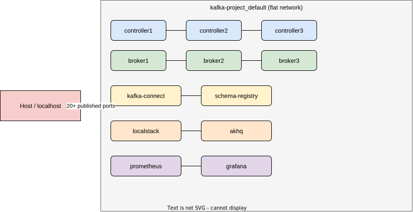
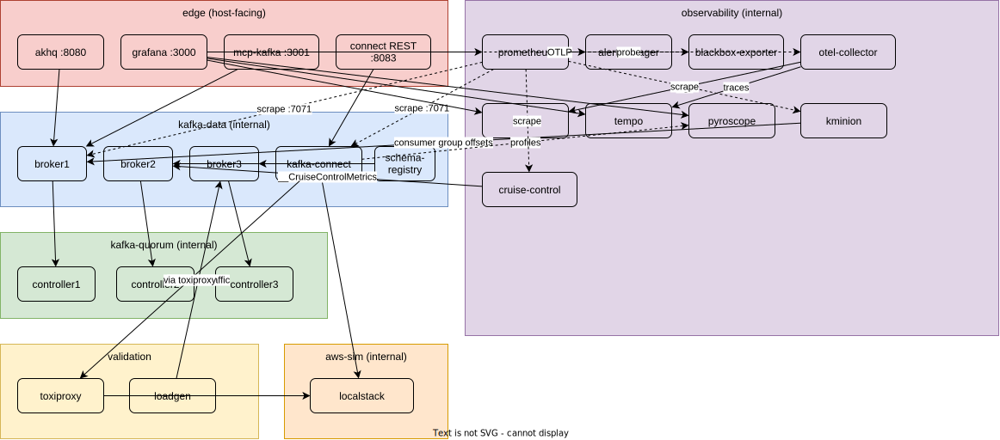

# 01 — Network Architecture

> Scope: Docker network topology for the Kafka KRaft cluster, Kafka Connect, Schema Registry, LocalStack, AKHQ, observability stack, and the MCP server.
> Status: **current state** documented as-is; **target state** is the segmented design below.

## 1. Current State (as-is)

All 11 containers share the single implicit Compose network (`kafka-project_default`). Every service can reach every other service on every port. There is no segmentation, and 20+ ports are published to the host.



**Problems with the flat model**

1. **No blast-radius containment.** A compromised AKHQ or Grafana container can open a TCP connection to the KRaft controller quorum (9093) or JMX RMI (9101) directly.
2. **Controller plane exposed to the host.** Ports 19093–19095 publish the CONTROLLER listener externally. Nothing outside the cluster should ever talk to the quorum.
3. **JMX RMI published to host** (9101–9103, 19101–19103). JMX without auth is remote code execution surface.
4. **Observability can write, not just read.** Prometheus only needs to *scrape*; on a flat network it can also reach broker client ports.

## 2. Target State: 4-Zone Segmentation

| Network | Purpose | Internal? | Members |
|---|---|---|---|
| `kafka-quorum` | KRaft controller ↔ broker metadata plane | `internal: true` | controllers 1–3, brokers 1–3 |
| `kafka-data` | Client protocol (produce/consume/admin) | `internal: true` | brokers 1–3, kafka-connect, schema-registry, akhq, mcp-kafka |
| `observability` | Metrics/logs/traces/profiles + alerting | `internal: true` (except grafana) | prometheus, alertmanager, blackbox-exporter, loki, tempo, **otel-collector**, pyroscope, kminion, cruise-control, grafana, all JMX exporter endpoints |
| `edge` | Host-facing entry points only | bridge | akhq, grafana, mcp-kafka, kafka-connect REST, cruise-control REST, ntfy, toxiproxy API (all loopback) |



### 2.1 Design rules

- **Controllers join `kafka-quorum` + `observability` only.** They never join `kafka-data` or `edge`. Remove host publishing of 19093–19095 entirely.
- **Brokers join `kafka-quorum` + `kafka-data` + `observability`.** Only the EXTERNAL listener (29092) may be published to the host, and only if host-side clients are actually needed.
- **LocalStack joins its own `aws-sim` network**, shared only with kafka-connect (the sole S3 client). AKHQ/Grafana have no reason to reach it.
- **JMX RMI ports (9101) are never published.** All metric access goes through the Prometheus JMX exporter agent on `:7071`, scraped only from the `observability` network. AKHQ's JMX panels can be dropped or replaced by Grafana links.
- **Prometheus is not published** in the target state; Grafana is the read surface. (Keep `:9090` behind a profile flag for debugging.)

### 2.2 Compose implementation snippet

```yaml
networks:
  kafka-quorum:
    internal: true
  kafka-data:
    internal: true
  observability:
    internal: true
  aws-sim:
    internal: true
  edge:
    driver: bridge

services:
  controller1:
    networks: [kafka-quorum, observability]
    # ports: REMOVED — no host exposure of quorum or JMX

  broker1:
    networks: [kafka-quorum, kafka-data, observability]
    ports:
      - "9092:29092"   # EXTERNAL listener only, keep only if host clients exist

  kafka-connect:
    networks: [kafka-data, aws-sim, observability, edge]
    ports:
      - "127.0.0.1:8083:8083"   # REST bound to loopback only

  localstack:
    networks: [aws-sim]

  prometheus:
    networks: [observability]

  grafana:
    networks: [observability, edge]
    ports:
      - "127.0.0.1:3000:3000"

  akhq:
    networks: [kafka-data, edge]
    ports:
      - "127.0.0.1:8080:8080"

  mcp-kafka:
    networks: [kafka-data, edge]
    ports:
      - "127.0.0.1:3001:3001"

  kminion:
    networks: [kafka-data, observability]
    # no host ports — Prometheus scrapes :8080 internally

  cruise-control:
    networks: [kafka-data, observability, edge]
    ports:
      - "127.0.0.1:9095:9090"   # CC REST/UI — loopback only (mutating API!)

  loki:
    networks: [observability]
    # :3100 internal only — Grafana + otel-collector reach it in-network

  tempo:
    networks: [observability]
    # :3200 query + :4317/:4318 OTLP internal; mcp-kafka joins observability to export traces

  otel-collector:
    networks: [observability]
    volumes:
      - /var/lib/docker/containers:/var/lib/docker/containers:ro  # filelog receiver — replaces promtail; see doc 04 F12
    # receivers: otlp :4317/:4318, filelog; exporters: loki, tempo, prometheus

  alertmanager:
    networks: [observability]
    # :9093 internal; routes to ntfy webhook

  ntfy:
    networks: [observability, edge]
    ports:
      - "127.0.0.1:8082:80"   # phone push notifications for alerts

  blackbox-exporter:
    networks: [observability, kafka-data, aws-sim]  # needs to reach probe targets
    # :9115 internal — probed BY prometheus, probes everything else

  pyroscope:
    networks: [observability]
    # :4040 internal; Connect/broker JVMs push profiles via pyroscope java agent

  kroxylicious:
    networks: [kafka-data, aws-sim]   # aws-sim for LocalStack KMS envelope encryption
    # :9192 internal proxy listener — clients point here instead of brokers (profile-gated)

  toxiproxy:
    networks: [kafka-data, aws-sim, edge]
    ports:
      - "127.0.0.1:8474:8474"  # control API — mutating, loopback only (doc 04 F16)
    # proxy :4567 → localstack:4566 for S3 fault injection

  loadgen:
    networks: [kafka-data]
    # kafka-producer-perf-test loop → topic events; no ports
```

Note the `127.0.0.1:` prefix on every published admin surface — the lab should never listen on `0.0.0.0` for management UIs, even locally (matters on shared networks / cafés / corporate LANs).

## 3. Listener & Port Map (target)

| Component | Listener | Port | Network | Host-published |
|---|---|---|---|---|
| controller1–3 | CONTROLLER (Raft) | 9093 | kafka-quorum | ❌ |
| broker1–3 | PLAINTEXT→SASL_SSL (internal) | 9092 | kafka-data | ❌ |
| broker1–3 | EXTERNAL | 29092 | edge (optional) | 9092/9093/9094 |
| broker/controller | JMX exporter HTTP | 7071 | observability | ❌ |
| kafka-connect | REST | 8083 | edge | 127.0.0.1:8083 |
| schema-registry | HTTP | 8081 | kafka-data | ❌ (AKHQ/Connect reach it internally) |
| localstack | Gateway | 4566 | aws-sim | ❌ (use `docker exec awslocal`) |
| akhq | HTTP | 8080 | edge | 127.0.0.1:8080 |
| grafana | HTTP | 3000 | edge | 127.0.0.1:3000 |
| prometheus | HTTP | 9090 | observability | ❌ (debug profile only) |
| mcp-kafka | SSE/HTTP | 3001 | edge | 127.0.0.1:3001 |
| kminion | metrics HTTP | 8080 | observability | ❌ |
| cruise-control | REST/UI | 9090 (container) | edge | 127.0.0.1:9095 |
| loki | HTTP push/query | 3100 | observability | ❌ |
| tempo | OTLP + query | 4317/4318, 3200 | observability | ❌ |
| otel-collector | OTLP in / exporters out | 4317/4318 | observability | ❌ |
| alertmanager | HTTP | 9093 | observability | ❌ |
| ntfy | HTTP push | 80 (container) | edge | 127.0.0.1:8082 |
| blackbox-exporter | probe HTTP | 9115 | observability | ❌ |
| pyroscope | ingest/query | 4040 | observability | ❌ |
| kroxylicious | Kafka proxy | 9192 | kafka-data | ❌ (profile: 127.0.0.1:9192) |
| toxiproxy | proxied S3 + control API | 4567 / 8474 | aws-sim / edge | control 127.0.0.1:8474 |
| loadgen | — | — | kafka-data | ❌ |

## 4. DNS & Service Discovery

- All intra-cluster addressing uses Compose DNS names (`broker1:9092`). Advertised listeners must stay split: `PLAINTEXT://brokerN:9092` (container DNS) vs `EXTERNAL://localhost:909N` (host).
- The MCP server uses the internal bootstrap `broker1:9092,broker2:9092,broker3:9092` — never the EXTERNAL listener — so it works even if host publishing is disabled.

## 5. Failure Domains

- Loss of any single network does not partition the quorum: controllers only depend on `kafka-quorum`.
- Observability is fail-open: if the `observability` network is removed, data plane traffic is unaffected (scrape errors only).
- LocalStack outage isolates to the Connect S3 sink (connector tasks fail; brokers unaffected) — see SLOs in doc 05.

## 6. PR 1 — Implementation Runbook

Scope of this PR: **only what exists today** (controllers, brokers, akhq, localstack, schema-registry, kafka-connect, prometheus, grafana). Services from doc 02 (mcp-kafka, kminion, cruise-control, loki/tempo/otel/pyroscope/alertmanager/ntfy/blackbox/kroxylicious/toxiproxy/loadgen) arrive in later PRs and will join the appropriate zones then. `aws-sim` is deferred; LocalStack shares `kafka-data` in Phase 1 to keep the diff small.

### 6.1 What changed in `clusters/docker-compose.yml`

1. Added top-level `networks:` block with four networks:
   - `kafka-quorum` — `internal: true` (no host route)
   - `kafka-data` — `internal: true`
   - `observability` — `internal: true`
   - `edge` — bridge (host-facing UIs only)
   Each has an explicit `name:` so the compose project prefix (`clusters_*`) is bypassed and diagrams/scrape configs stay stable.
2. Assigned every service to its zone(s):
   | Service | Networks |
   |---|---|
   | controller1–3 | `kafka-quorum`, `observability` |
   | broker1–3 | `kafka-quorum`, `kafka-data`, `observability`, `edge` |
   | schema-registry, akhq | `kafka-data`, `edge` |
   | kafka-connect | `kafka-data`, `edge` |
   | localstack | `kafka-data`, `edge` (temporary — becomes `aws-sim` in a later PR) |
   | prometheus, grafana | `observability`, `edge` |
3. Removed all host-published quorum + JMX ports (`19093–19095`, `19101–19103`, `17071–17073`, `9101–9103`, `7071–7073`). JMX and jmx-exporter are still reachable **inside** the appropriate networks.
4. Rewrote every remaining host port as `127.0.0.1:X:Y`. The EXTERNAL broker listener is still published (host producers/consumers need it) but only on loopback.
5. Fixed AKHQ's JMX targets: they now use each broker's **container-internal** port `9101` (was reaching host-mapped ports `9101/9102/9103` that no longer exist).
6. Set `LAMBDA_DOCKER_NETWORK: kafka-data` on LocalStack (was `kafka-project_default`, which does not exist anymore).
7. Dropped the wide `4510-4559` LocalStack port range — the `:4566` gateway is the only endpoint we use.

### 6.2 Apply

```bash
cd clusters
docker compose down                # ONE-TIME: drops the old kafka-project_default network
docker compose config --quiet      # syntax check → exit 0
docker compose up -d
docker compose ps
```

`docker compose down` is required exactly once: the old flat network cannot be reused, and existing containers are still attached to it until they are recreated.

### 6.3 Verification checklist

Run these after `up -d` and paste the output into the PR description.

```bash
# 1. Four zones exist with the expected internal flag
docker network ls --format '{{.Name}}\t{{.Driver}}\t{{.Scope}}' | grep -E '^(kafka-quorum|kafka-data|observability|edge)\b'
for n in kafka-quorum kafka-data observability; do
  echo -n "$n internal="; docker network inspect "$n" -f '{{.Internal}}'
done
# Expected: internal=true for the first three, edge is external.

# 2. Every service is on the right networks
docker inspect controller1 -f '{{range $k,$v := .NetworkSettings.Networks}}{{$k}} {{end}}'
# Expected: kafka-quorum observability

docker inspect broker1 -f '{{range $k,$v := .NetworkSettings.Networks}}{{$k}} {{end}}'
# Expected: kafka-quorum kafka-data observability edge  (order may vary)

# 3. Quorum + JMX ports are NOT reachable from the host
for p in 19093 19094 19095 19101 19102 19103 17071 17072 17073 9101 9102 9103 7071 7072 7073; do
  ss -tln "sport = :$p" | grep -q ":$p" && echo "LEAK :$p" || echo "ok   :$p"
done

# 4. Loopback-only binds for every exposed UI/API
ss -tln | grep -E '127\.0\.0\.1:(9092|9093|9094|8080|8081|8083|4566|9090|3000)\b'
# Expected: nine matches on 127.0.0.1, no 0.0.0.0 bindings.

# 5. Producer from host still works (edge path)
kafka-console-producer --bootstrap-server 127.0.0.1:9092 --topic __smoke <<<"pr1-hello"

# 6. Prometheus can still scrape brokers (observability path)
docker exec prometheus wget -qO- http://broker1:7071/metrics | head -1
# Expected: a kafka_* metric line (not connection refused)

# 7. AKHQ can still see the cluster (kafka-data path)
curl -sf 127.0.0.1:8080/api/kafka-kraft-cluster/topic > /dev/null && echo "akhq ok"

# 8. Blast-radius proof: a container on `edge` only cannot reach the quorum
docker run --rm --network edge nicolaka/netshoot sh -c 'nc -zvw2 controller1 9093 2>&1' | grep -q 'succeeded\|open' && echo "LEAK: edge→quorum" || echo "ok: edge blocked from quorum"
```

Every command should pass. Any `LEAK` line is a merge-blocker.

### 6.4 Rollback

If anything breaks in verification, roll back with:

```bash
git checkout main -- clusters/docker-compose.yml
docker compose down
docker compose up -d
```

Data is preserved (volumes are untouched).

### 6.5 Out of scope (deferred to later PRs)

- Healthchecks + pinned image digests → PR 2.
- New services (kminion, alertmanager, otel-collector, loki, tempo, pyroscope, mcp-kafka, cruise-control, kroxylicious, toxiproxy, loadgen) → PRs 3–9. They will attach to the zones defined here.
- Dedicated `aws-sim` network for LocalStack → moves out of `kafka-data` when the S3 traffic is proxied through Kroxylicious/toxiproxy in PR 6/PR 9.
- SASL / ACLs / TLS → PRs 8+.
