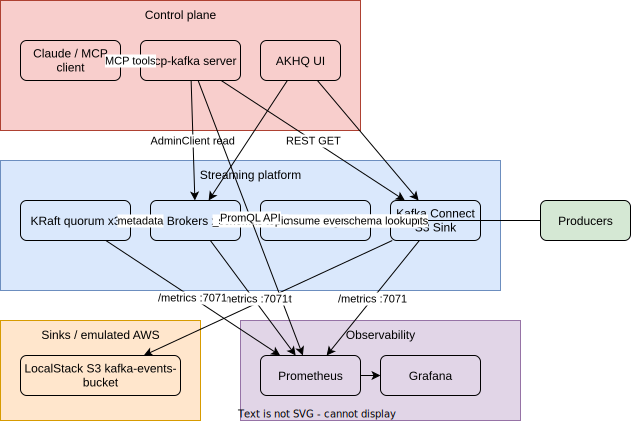
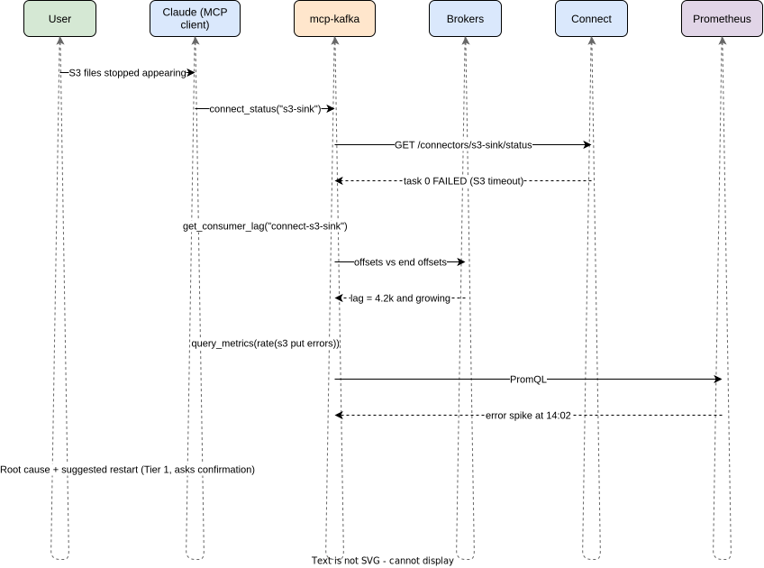
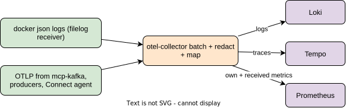
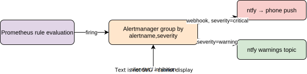

# 02 — System Integration Architecture

> How the 25 components integrate: protocols, contracts, startup ordering, and the MCP control-plane layer. All services now build from `services/<name>/Dockerfile`; central version pinning in `clusters/.env`. See `PLAN-DOCKERFILES.md` for the migration record.

## 0. Stack status (bring-up)

| Group | Services | Status |
|---|---|---|
| Kafka core | 3× controller, 3× broker | ✅ Up. JMX + OTel javaagent baked. Brokers also carry the Cruise Control metrics reporter JAR (built in an isolated gradle stage from the linkedin/cruise-control tag). |
| Confluent JVM | kafka-connect (S3 sink baked), schema-registry | ✅ Up. JMX + OTel javaagent baked. |
| Observability | prometheus, grafana, loki, tempo, pyroscope, alertmanager, blackbox-exporter, otel-collector, kminion, ntfy | ✅ Up. Thin config-wrap images pinned to explicit versions. |
| Admin / storage / notify | akhq (config baked into image), localstack | ✅ Up. |
| Rebalancer | cruise-control | ✅ Up. `hard.goals` aligned with `default.goals`; `kafka.broker.failure.detection.enable=true` for KRaft. |
| Proxy | kroxylicious | ✅ Up (pass-through). RecordEncryption filter chain deferred — starter proxy.yaml uses the 0.10.0 map-form `virtualClusters:` schema. |
| Fault injection | toxiproxy | ✅ Up. Starter Connect→LocalStack toxic. |
| AI control plane | mcp-kafka | ✅ Up. Tier-0 read-only tools listed in §3.2. |
| Synthetic traffic | loadgen | ✅ Up. OTel auto-instrumented (spans → Tempo, logs → Loki). `restart: on-failure` for broker warm-up race. |

## 1. Component Inventory & Contracts

| # | Component | Role | Integrates with | Protocol | Contract |
|---|---|---|---|---|---|
| 1 | controller1–3 | KRaft metadata quorum | brokers | Kafka Raft (9093) | `KAFKA_CONTROLLER_QUORUM_VOTERS` |
| 2 | broker1–3 | Data plane | everything | Kafka protocol (9092) | topics, ACLs |
| 3 | kafka-connect | Integration runtime | brokers, schema-registry, localstack | Kafka + HTTP REST (8083) | connector configs, internal topics `_connect-{configs,offsets,status}` RF=3 |
| 4 | schema-registry | Schema governance | brokers (storage), connect/producers (clients) | HTTP (8081) | subjects + compatibility mode |
| 5 | localstack | AWS emulation (S3, SSM, Secrets Manager, KMS…) | kafka-connect, init scripts | HTTP (4566) | bucket `kafka-events-bucket` |
| 6 | akhq | Admin UI | brokers, connect | Kafka + REST | read/manage topics & connectors |
| 7 | prometheus | Metrics TSDB | all JMX exporters (:7071) | HTTP scrape | 15s interval |
| 8 | grafana | Dashboards | prometheus | HTTP | provisioned datasource + dashboards |
| 9 | **mcp-kafka** | **AI control plane** | brokers, connect, schema-registry, prometheus, loki, tempo | MCP (stdio/SSE) | tool schema (below) |
| 10 | producers (Python) | Test workload | brokers | Kafka protocol | topic `events` |
| 11 | **kminion** | Consumer-lag & topic exporter | brokers (read-only), prometheus | Kafka protocol → /metrics :8080 | lag-in-seconds SLIs |
| 12 | **cruise-control** | Rebalancing / self-healing | brokers, `__CruiseControlMetrics` topic, prometheus | Kafka + REST (9090) | goals config + metrics reporter JAR in brokers |
| 13 | **loki** | Log aggregation | otel-collector (push), grafana/mcp (query) | HTTP 3100 | labels: `{container, component, level}` |
| 14 | **tempo** | Distributed traces | mcp-kafka + instrumented clients (OTLP), grafana | OTLP 4317/4318, query 3200 | trace context via W3C `traceparent` in Kafka headers |
| 15 | **otel-collector** | Unified telemetry pipeline (replaces promtail) | docker logs (filelog), OTLP sources → loki/tempo/prometheus | OTLP 4317/4318 | processors: batch, redaction, attribute mapping |
| 16 | **alertmanager** | Alert routing, grouping, silencing | prometheus (rules), ntfy (webhook) | HTTP 9093 | route tree by `severity` label |
| 17 | **ntfy** | Push notifications (phone) | alertmanager webhook | HTTP | topic per severity |
| 18 | **blackbox-exporter** | Synthetic probes | prometheus (probe target param) | HTTP 9115 | modules: http_2xx, tcp, kafka metadata script |
| 19 | **pyroscope** | Continuous profiling | Connect/broker JVMs (java agent push), grafana | HTTP 4040 | flame graphs tagged `{service, pod}` |
| 20 | **kroxylicious** | Kafka protocol proxy: policy + envelope encryption | clients ↔ brokers; LocalStack KMS | Kafka wire protocol 9192 | filter chain: `RecordEncryption` (KMS DEK per topic) |
| 21 | **toxiproxy** | Fault injection | sits on Connect→LocalStack path; control API | TCP proxy 4567 / API 8474 | toxics: latency, bandwidth, timeout, slicer |
| 22 | **loadgen** | Continuous synthetic traffic | brokers | Kafka protocol | steady baseline: N msg/s → `events` |

## 2. Integration Diagram



## 3. MCP Integration Layer (the "with MCP" part)

The MCP server turns the cluster into something an AI agent can *inspect and diagnose* through typed tools instead of shell access.

### 3.1 Deployment

```yaml
  mcp-kafka:
    build: ./mcp
    container_name: mcp-kafka
    environment:
      KAFKA_BOOTSTRAP_SERVERS: "broker1:9092,broker2:9092,broker3:9092"
      CONNECT_URL: "http://kafka-connect:8083"
      SCHEMA_REGISTRY_URL: "http://schema-registry:8081"
      PROMETHEUS_URL: "http://prometheus:9090"
      MCP_MODE: "read-only"           # guardrail default — see doc 04
      MCP_TRANSPORT: "sse"            # sse for network clients, stdio for local
    networks: [kafka-data, observability, edge]
    ports:
      - "127.0.0.1:3001:3001"
    depends_on:
      - broker1
      - kafka-connect
```

### 3.2 Tool surface (proposed contract)

**Tier 0 — read-only (enabled by default)**

| Tool | Backend call | Use case |
|---|---|---|
| `list_topics` | AdminClient.listTopics | inventory |
| `describe_topic` | describeTopics + describeConfigs | partition/RF/config audit |
| `list_consumer_groups` / `describe_group` | AdminClient | lag & membership |
| `get_consumer_lag` | listConsumerGroupOffsets vs endOffsets | lag diagnosis |
| `cluster_health` | describeCluster + URP/offline metrics via PromQL | one-shot health check |
| `connect_status` | GET /connectors/{name}/status | S3 sink diagnosis |
| `get_schema` | GET /subjects/{s}/versions/latest | contract inspection |
| `query_metrics` | Prometheus HTTP API (allowlisted queries) | SLI evaluation |
| `tail_topic` | bounded consumer (max N msgs, max T secs) | payload sampling |

**Tier 1 — mutating (opt-in via `MCP_MODE=admin`, per-tool allowlist)**

| Tool | Backend | Guardrail |
|---|---|---|
| `create_topic` | AdminClient | name prefix allowlist (`lab.*`), RF/partitions bounds |
| `restart_connector` / `restart_task` | POST /connectors/…/restart | rate-limited |
| `pause_resume_connector` | PUT /connectors/…/pause | audit-logged |

**Never exposed:** `delete_topic` on `_*` internal topics, ACL mutation, broker config alteration, arbitrary PromQL admin API, consumer offset reset without `dry_run=true` first.

### 3.3 Interaction sequence (example: "why isn't S3 receiving files?")



## 3.4 New tools enabled by the LGTM + CC stack

Tier 0 additions to the MCP surface:

| Tool | Backend | Use case |
|---|---|---|
| `search_logs` | Loki LogQL (templated queries only) | "show Connect ERRORs in the last 15m" |
| `get_trace` | Tempo query API | follow one event produce→sink with `traceparent` header |
| `get_consumer_lag` (upgraded) | **kminion metrics via Prometheus** instead of raw AdminClient math | lag in seconds, not offsets |
| `cluster_balance_status` | Cruise Control `GET /kafkacruisecontrol/state` + `/proposals?dry_run=true` | "is the cluster balanced? what would a rebalance move?" |
| `get_profile` | Pyroscope query API (service + time range) | "what was Connect allocating when heap alert fired?" |
| `list_chaos_scenarios` / `chaos_status` | toxiproxy API (read) | inspect active toxics |

Tier 1 additions: `run_chaos_scenario` → toxiproxy (allowlisted scenarios only, auto-expiring toxics, never on `kafka-quorum` paths).

Tier 1 (admin mode only): `trigger_rebalance` → CC `POST /rebalance?dryrun=false` — the single most dangerous tool in the platform; requires explicit confirmation flow and is rate-limited to 1/hour.

## 3.5 Cruise Control wiring (broker-side dependency)

CC is the only new service that changes **broker** config: each broker loads the `cruise-control-metrics-reporter` JAR:

```yaml
  broker1:
    volumes:
      - ./cc-metrics-reporter:/opt/cc-reporter
    environment:
      KAFKA_METRIC_REPORTERS: "com.linkedin.kafka.cruisecontrol.metricsreporter.CruiseControlMetricsReporter"
      CLASSPATH: "/opt/cc-reporter/cruise-control-metrics-reporter-*.jar"
```

Reporter produces to `__CruiseControlMetrics` (RF=3); CC consumes it to build its load model. Goals config (`goals=RackAware,ReplicaCapacity,DiskCapacity,NetworkInbound…`) lives in `cruise-control/config/cruisecontrol.properties`. Self-healing (anomaly detector auto-fix) stays **disabled** in the lab — detection on, remediation manual, matching how a bank would run it.

## 3.6 Trace propagation contract

Producers inject W3C `traceparent` as a Kafka record header (OTel Kafka instrumentation does this automatically). Connect and the MCP `tail_topic` tool surface the header, so one trace ID links: producer span → broker append (implicit) → sink task span → S3 PutObject span. Tempo's service graph then draws the pipeline topology from real traffic.

## 3.7 OTel Collector as the single telemetry pipeline

The collector consolidates what were three separate paths:



Benefits over per-signal shippers: one redaction/PII processor for everything (doc 04 F15), one place to add/drop attributes, one backpressure/queue config, and swapping backends (e.g., Loki → anything OTLP) becomes config-only. This mirrors the production-standard pattern (agent/gateway collector).

## 3.8 Alerting path



Inhibition rule worth having: `KafkaNoActiveController` inhibits all broker-level alerts (one page, not twelve). Blackbox-exporter feeds the synthetic SLIs from doc 05 (`probe_success` per module/target).

## 3.9 Continuous profiling (Pyroscope)

Connect and broker JVMs run the Pyroscope java agent (`-javaagent:pyroscope.jar`, push mode, ~1% overhead). This directly instruments the known production failure mode: **Connect heap pressure → premature S3 flushes**. When `ConnectHeapPressure` fires, the flame graph for that exact window shows *which* allocation path grew — turning a STAR story into a live, reproducible demo. Grafana gets Pyroscope as a datasource; alerts link to the profile time range.

## 3.10 Kroxylicious (governance proxy — profile-gated)

Optional `--profile governance`: clients bootstrap via `kroxylicious:9192` instead of brokers. Filter chain enables **transparent envelope encryption**: per-topic DEKs wrapped by a KMS key in LocalStack KMS — producers/consumers unchanged, records encrypted at rest in the brokers. This is a differentiated fintech story: field-level/record-level crypto without touching a single client. Trade-off documented: +1 hop latency (measure it — see doc 05 §8.4) and the proxy becomes part of the write-path SLO composition.

## 3.11 Fault injection & synthetic load

- **toxiproxy** fronts LocalStack: Connect's S3 URL points at `toxiproxy:4567`. `tools/chaos.sh` scripts scenarios: `s3-latency-800ms`, `s3-timeout`, `s3-bandwidth-64kb`. Each scenario has an *expected outcome* (which alert fires, within how long) — doc 03 §6 becomes a test suite.
- **loadgen** produces a steady baseline (e.g., 50 msg/s) so 7-day SLOs have continuous data and chaos experiments have signal to disturb.

## 4. Startup Ordering & Readiness

Current compose uses `depends_on: service_started` for Kafka, which races (brokers accept TCP before joining the quorum). Target:

1. Add healthchecks: brokers → `kafka-broker-api-versions --bootstrap-server localhost:9092`; connect → `curl -f :8083/connectors`; schema-registry → `curl -f :8081/subjects`.
2. Chain: controllers (healthy) → brokers (healthy) → schema-registry + localstack (healthy) → kafka-connect → akhq / mcp-kafka / kminion / cruise-control / kroxylicious. Observability plane (otel-collector, loki, tempo, pyroscope, prometheus, alertmanager, grafana) starts in parallel — it has no hard dependency on Kafka being up (fail-open). loadgen starts last (needs brokers healthy); toxiproxy before kafka-connect (Connect's S3 URL points at it).
3. Connector creation stays out-of-band (`kafka.sh connector-create`) or moves to an idempotent init container that POSTs the config with retry.

## 7. PR 2 Runbook — Observability + Platform Stack

### What changed

- **kminion**: Kafka consumer-lag and topic metrics exporter; scrapes broker1-3:9092, exposes `/metrics` on :8080 inside `observability` network.
- **otel-collector**: Single OpenTelemetry pipeline (logs via filelog, traces via OTLP); ships to Loki (logs) and Tempo (traces); self-metrics on :8889.
- **loki**: Log aggregation backend, single-binary, filesystem storage under `/loki`, 168h retention.
- **tempo**: Distributed tracing backend, single-binary, OTLP grpc+http receivers, local storage under `/tmp/tempo`.
- **pyroscope**: Continuous profiling backend, single-binary, storage under `/data`.
- **alertmanager**: Alert routing via ntfy webhook (`http://ntfy/kafka-alerts-c3f8a2d1`); grouped by `cluster` + `alertname`; not host-exposed.
- **blackbox-exporter**: Synthetic HTTP/TCP probe endpoint at `:9115` inside `observability`.
- **cruise-control**: Kafka rebalancing and anomaly-detection UI; Phase 1 (no security, self-healing off); host port `127.0.0.1:9095:9090`.
- **ntfy**: Notification push service; Alertmanager webhook target; host port `127.0.0.1:8082:80`.
- **prometheus.yml**: Added `alerting:` block + rule_files reference + 8 new scrape jobs.
- **metrics/rules/kafka.rules.yml**: 3 sample alert rules (UnderReplicatedPartitions, ConsumerLag>10k, BrokerDown).
- **metrics/grafana/datasources/datasources.yml**: Added Loki, Tempo, Pyroscope datasources with correlation links.
- **clusters/config/**: 9 new service config files.

### Apply steps

```bash
git switch feat/pr2-observability-stack
cd clusters

# First-time: bring up new services alongside existing ones
docker compose up -d

# Wait for healthchecks (~60s for cruise-control)
docker compose ps
```

### Verification block

```bash
# All new services healthy
docker compose ps --format 'table {{.Service}}\t{{.Status}}' | grep -E 'kminion|otel|loki|tempo|pyroscope|alertmanager|blackbox|cruise-control|ntfy'

# Prometheus targets all UP
curl -s 127.0.0.1:9090/api/v1/targets | jq '.data.activeTargets[] | select(.health!="up") | {job:.labels.job,url:.scrapeUrl,err:.lastError}'
# Expected: empty output

# Loki ingesting logs (via otel-collector filelog)
curl -sG 127.0.0.1:9090/api/v1/query --data-urlencode 'query=loki_ingester_streams' | jq '.data.result[0].value[1]' # >0

# Tempo receiving traces (self-check)
curl -sf http://127.0.0.1:9090/api/v1/query?query=tempo_ingester_traces_created_total >/dev/null && echo ok

# Kminion lag metric present
curl -sG 127.0.0.1:9090/api/v1/query --data-urlencode 'query=kminion_kafka_topic_partition_high_water_mark' | jq '.data.result | length'  # >0

# Cruise Control reachable on edge only (loopback)
curl -sf http://127.0.0.1:9095/kafkacruisecontrol/state | jq '.KafkaBrokerState' | head -3

# ntfy loopback bind
ss -tln | grep -E '127\.0\.0\.1:8082' && echo ok

# Alertmanager reachable inside observability only, not from host
ss -tln | grep -qE '127\.0\.0\.1:9093|0\.0\.0\.0:9093' && echo "LEAK" || echo "ok"

# Blast-radius proof: edge container cannot hit loki
docker run --rm --network edge nicolaka/netshoot sh -c 'nc -zvw2 loki 3100 2>&1' | grep -q 'succeeded\|open' && echo "LEAK: edge→loki" || echo "ok: edge blocked from loki"
```

### Rollback

```bash
git checkout feat/pr1-network-segmentation -- clusters/docker-compose.yml metrics/
docker compose up -d
```

---

## 5. Configuration Contracts

- **Cluster ID** is pinned (`1490b9b6-…`) — document that changing it orphans volumes.
- **Connect internal topics** RF=3 must survive any broker count change; add `min.insync.replicas=2` to match producer `acks=all` guarantees.
- **Schema Registry** should become the converter for `events` (`AvroConverter` + `schemas.enable=true`) — today it's deployed but bypassed (JsonConverter, schemas disabled), which is a portfolio talking point: *"deployed vs integrated"*.
- **Secrets**: move `AWS_ACCESS_KEY_ID/SECRET` from compose env to LocalStack Secrets Manager, resolved at startup via `ConfigProvider` (`config.providers=secretsmanager`) — mirrors the production pattern (doc 04 §3).
