# 03 — Data Flow Architecture

> Every byte path in the platform: event flow, metadata flow, schema flow, metrics flow, and MCP query flow — with delivery semantics at each hop.

## 1. Primary Event Flow (produce → S3)

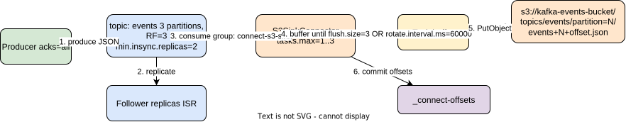

### Delivery semantics per hop

| Hop | Semantics | Controlled by | Failure behavior |
|---|---|---|---|
| Producer → broker | at-least-once (effectively-once with `enable.idempotence=true`) | `acks=all`, `min.insync.replicas=2` | retries; blocks if ISR < 2 |
| Broker replication | synchronous within ISR | RF=3 | leader election on broker loss; URP > 0 signal |
| Connect consume | at-least-once | consumer group offsets in `_connect-offsets` | task restart resumes from last commit |
| Sink → S3 | **exactly-once per S3 object** (deterministic filenames `topic+partition+startOffset`) | S3SinkConnector design | re-upload overwrites same key — idempotent |
| Offset commit | after successful flush | connector framework | crash between flush and commit ⇒ duplicate object write (harmless, same key) |

**Key flush trap (documented from production experience):** files only materialize after `flush.size` records **or** `rotate.interval.ms`. Under low traffic + JVM memory pressure, premature flushes fragment objects into many tiny files — track `kafka_connect_s3_*` object-size distribution (doc 05 §4).

## 2. Metadata Flow (KRaft)

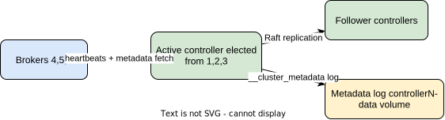

- Quorum tolerates loss of **1 controller** (majority of 3). Loss of 2 freezes metadata ops (no new topics, no leader elections) while data plane keeps serving.
- Broker registration/fencing flows only over the CONTROLLER listener — this is why doc 01 isolates it on `kafka-quorum`.

## 3. Schema Flow (target state)

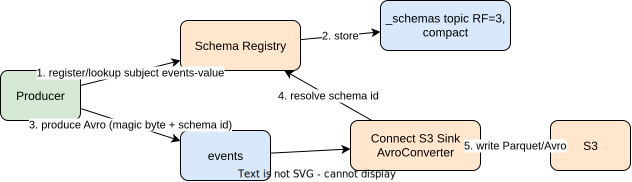

Compatibility mode `BACKWARD` on `events-value`; schema evolution becomes a governed operation instead of a silent JSON drift. (Current state: JsonConverter, schemas disabled — SR is idle.)

## 4. Metrics Flow

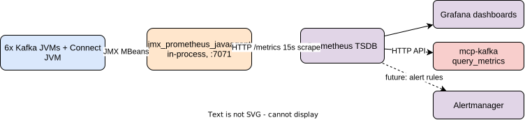

- In-process javaagent (already implemented) avoids sidecar exporters and captures JVM + Kafka MBeans atomically.
- **kminion** adds what JMX cannot: consumer-group lag as offsets *and* time (`kminion_kafka_consumer_group_topic_lag`, plus end-offset progression to derive lag-in-seconds). It is a plain Kafka client — read-only, its own principal under ACLs.
- Cardinality guardrail: per-topic-per-partition series explode fast; keep `jmx-exporter-config.yml` rules scoped (drop `kafka_log_log_*` per-segment metrics). Same discipline in kminion: `-allowed-groups` regex if group count grows.

## 4.1 Logs Flow (OTel Collector → Loki)

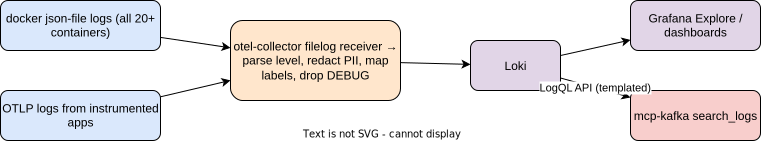

Label discipline is the Loki equivalent of the cardinality guardrail: labels = `{container, component, level}` only; everything else (topic names, connector names, trace IDs) stays in the log line and is queried with LogQL filters. High-cardinality labels kill Loki the way per-partition series kill Prometheus. Current `KAFKA_LOG4J_LOGGERS: org.apache.kafka=DEBUG` must drop to INFO first, or the collector's drop-stage will burn CPU discarding noise. The collector's redaction processor runs *before* export — PII never reaches storage (single choke point for doc 04 F15).

## 4.2 Traces Flow (Tempo)

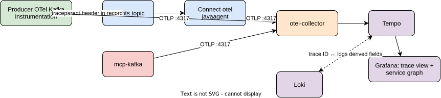

One trace = one event's full journey: producer send span → sink task process span → S3 PutObject span, correlated by the `traceparent` header traveling *inside* the Kafka record. Grafana derived fields link a Loki ERROR line to its trace and back — the three-pillar correlation story in one demo.

## 4.3 Cruise Control Feedback Loop

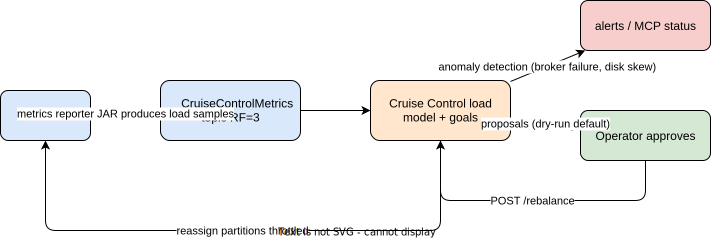

CC is unusual: it consumes the cluster's own metrics *through Kafka itself* — meaning a badly degraded cluster can blind its own balancer. That circular dependency is why the anomaly *detector* alerts through Prometheus (out-of-band) while *remediation* stays human-approved in the lab.

## 4.4 Profiles Flow (Pyroscope)

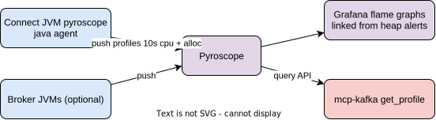

The alloc profile during a `ConnectHeapPressure` window is the root-cause artifact for the premature-flush failure mode — heap %, flame graph, tiny-object S3 metric, and connector logs all correlate on the same timeline in Grafana.

## 4.5 Alert Flow

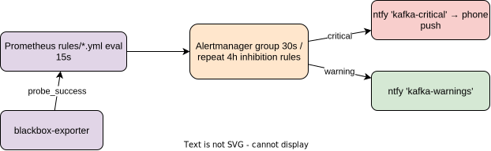

## 4.6 Encrypted Write Path (Kroxylicious profile)

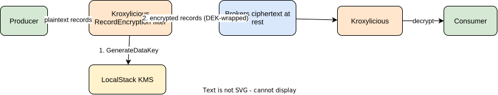

Brokers, AKHQ, and any direct consumer see only ciphertext — governance enforced at the protocol layer, zero client changes. Note the interaction: `tail_topic` via MCP must go *through* the proxy to be useful, and the S3 sink either goes through it (plaintext in S3) or bypasses it (ciphertext archived) — an explicit, documented decision per topic.

## 4.7 Chaos Validation Flow

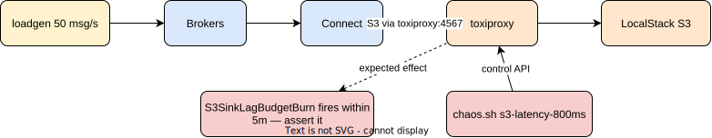

Every scenario is a tuple *(toxic, expected alert, max detection time)* — failure propagation (§6) stops being theory and becomes CI-runnable evidence that the SLO/alert pipeline works end to end.

## 5. MCP Query Flow (read path)

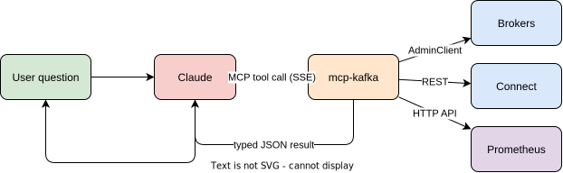

Read path touches **zero** data-plane writes; `tail_topic` uses an ephemeral consumer group (`mcp-tail-<uuid>`, `auto.offset.reset=latest`, bounded) so it never disturbs committed offsets of real consumers.

## 6. Backpressure & Failure Propagation Map

| Failure | Immediate effect | Downstream propagation | Detection SLI |
|---|---|---|---|
| 1 broker down | leader elections; URP > 0 | none if ISR≥2 holds | `underreplicatedpartitions > 0` |
| 2 brokers down | ISR < min.insync ⇒ producers with acks=all block | producer timeouts; consumer OK on remaining leaders | produce error rate |
| LocalStack down | S3 sink tasks FAIL | consumer lag on `events` grows; brokers retain per `retention.ms` | connector task state + lag |
| Connect JVM OOM | tasks rebalance/restart; premature flushes | tiny S3 objects, duplicate keys | JVM heap %, task restart count |
| Controller quorum loss (2/3) | metadata plane frozen | no new topics/elections; existing traffic continues until next failure | active controller count ≠ 1 |
| Prometheus down | no metrics/no alerts | **observability blind spot only** — data plane unaffected | Grafana datasource error, `up` absent |
| kminion down | lag SLIs go stale | freshness alerts blind (fail-open risk) | `absent(kminion_kafka_consumer_group_topic_lag)` alert |
| Loki/Tempo down | logs/traces lost for the outage window | debugging degraded; data plane unaffected | `up{job=~"loki\|tempo"}` |
| Cruise Control down | no rebalance capability; anomaly detection off | cluster runs, skew accumulates silently | CC `/state` blackbox probe |
| CC bad rebalance (misconfigured goals) | mass partition reassignment ⇒ replication traffic storm | produce/fetch latency spike cluster-wide | reassignment rate + p99 latency; **dry-run-first policy is the guardrail** |
| otel-collector down | logs+traces lost (queue buffers briefly) | Loki/Tempo starve; metrics scrape unaffected | `up{job="otel-collector"}` + queue size |
| Alertmanager down | rules fire into the void | **silent failure — worst kind**; deadman switch required | `Watchdog` always-firing alert; absence at ntfy = AM dead |
| Kroxylicious down (governance profile) | proxied clients lose connectivity entirely | full produce/consume outage for proxied topics | proxy `up` + client connection errors; proxy joins the write-path SLO chain |
| LocalStack KMS down (governance profile) | DEK generation fails ⇒ encrypted produces fail | same as broker outage for encrypted topics | KMS canary probe |
| toxiproxy stuck toxic (forgot cleanup) | permanent artificial S3 latency | lag SLO burns "for real" | auto-expiring toxics + `chaos_status` audit |

The retention window on `events` is the **recovery budget** for any sink outage: outage longer than `retention.ms` = permanent data loss to S3. This is formalized as an SLO in doc 05 §6.
