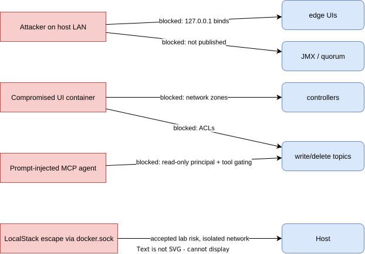

# 04 — Security Guardrails Analysis

> Honest current-state assessment → prioritized guardrail roadmap. Framed the way a production review would be: findings, risk, remediation, and what is intentionally accepted in a lab.

## 1. Current-State Findings (from the actual compose)

| # | Finding | Severity (if prod) | Evidence |
|---|---|---|---|
| F1 | All listeners PLAINTEXT (client, inter-broker, controller) | Critical | `KAFKA_LISTENER_SECURITY_PROTOCOL_MAP: ...PLAINTEXT` everywhere |
| F2 | No authentication on Kafka, Connect REST, Schema Registry, Prometheus | Critical | no SASL / no basic auth configured |
| F3 | No authorization (no ACLs) — any client can create/delete/read anything | Critical | no `authorizer.class.name` |
| F4 | JMX RMI ports published to host without auth | Critical | `9101:9101` etc. — JMX is an RCE surface |
| F5 | Controller quorum ports published to host | High | `19093–19095` |
| F6 | Docker socket mounted into LocalStack | High | `/var/run/docker.sock` — container escape ≡ host root |
| F7 | Hardcoded credentials in compose (`test/test`, `admin/admin`) | High | AWS keys + Grafana admin in env |
| F8 | `:latest` image tags on all 8 images | Medium | non-reproducible, supply-chain drift |
| F9 | Brokers/controllers previously spanned the `observability` zone (see doc 01 §7) | Medium | **Fixed in PR 5:** broker/controller nodes removed from `observability`; six jmx-exporter sidecar containers act as the only bridge; observability→broker:9092 now fails (blast radius closed) |
| F10 | Connect REST allows arbitrary connector creation ⇒ arbitrary JVM code via connector plugins | High | unauthenticated 8083 |
| F11 | DEBUG logging on `org.apache.kafka` | Low | log-volume + potential data leakage in logs |
| F12 | Telemetry shipper needs host log access | Medium | **otel-collector** mounts `/var/lib/docker/containers` **read-only** (no docker.sock at all — better than promtail's socket); collector on `observability` net only |
| F13 | Cruise Control REST is unauthenticated and mutating (rebalance, demote/remove broker) | High | bind 127.0.0.1 only (Phase 1) + enable CC HTTP Basic Auth + `webserver.security.enable=true` (Phase 2); MCP reaches only `/state` and `/proposals?dry_run=true` |
| F14 | Loki/Tempo/Pyroscope ingest unauthenticated | Low (internal net) | acceptable on `internal: true` network; enable multi-tenancy header (`X-Scope-OrgID`) if ever exposed |
| F15 | Logs may carry payloads/PII into Loki | Medium | **single choke point:** otel-collector redaction processor runs before any export; retention limit (`retention_period: 168h`) |
| F16 | toxiproxy control API can degrade the platform (attacker-grade capability by design) | High | loopback-only API; allowlisted scenarios in `chaos.sh`; auto-expiring toxics (TTL); every toxic change audit-logged; **never** proxies quorum traffic |
| F17 | ntfy topics are unauthenticated by default (anyone who guesses the topic reads alerts / pushes fakes) | Medium | random topic suffix + ntfy access tokens; alerts contain system names only, never payloads/secrets |
| F18 | Kroxylicious holds KMS credentials + sees plaintext of every proxied record | High (by design) | it *is* the trust boundary: dedicated network zones, read-only rootfs, pinned digest, KMS key policy scoped to GenerateDataKey/Decrypt on one key; log level WARN (never log record contents) |
| F19 | Alertmanager silence/config API unauthenticated | Low | internal net only; silences via amtool from host through `docker exec` |

**Accepted lab risks (documented, not fixed):** F6 is required for LocalStack Lambda executor; mitigate by keeping LocalStack on isolated `aws-sim` network and never running this stack on a shared host.

## 2. Guardrail Roadmap (priority order)

### Phase 1 — Network guardrails (zero app changes)
- 4-zone segmentation from doc 01; remove controller + JMX host publishing; bind all UIs to `127.0.0.1`.
- **Result:** F4, F5, F9 closed; F10 blast radius reduced to loopback.

### Phase 2 — Authentication (SASL/SCRAM-SHA-512)
```properties
# broker
listener.security.protocol.map=CONTROLLER:SASL_PLAINTEXT,INTERNAL:SASL_PLAINTEXT,EXTERNAL:SASL_PLAINTEXT
sasl.enabled.mechanisms=SCRAM-SHA-512
sasl.mechanism.inter.broker.protocol=SCRAM-SHA-512
```
Principals: `admin` (super.users), `connect`, `producer-events`, `akhq`, `mcp-readonly`. Credentials created via `kafka-storage format --add-scram` (KRaft bootstrap) — SCRAM users in KRaft can be seeded at format time, avoiding the chicken-and-egg of needing an authenticated client to create the first user.

### Phase 3 — Authorization (ACLs, least privilege)
```text
principal User:connect        → READ topic events; READ/WRITE _connect-*; group connect-s3-sink
principal User:producer-events → WRITE topic events; IDEMPOTENT_WRITE cluster
principal User:mcp-readonly   → DESCRIBE cluster/topics/groups; READ topic events (tail); NO write, NO create
principal User:akhq           → DESCRIBE + READ (read-only UI mode)
principal User:kminion        → DESCRIBE cluster/topics/groups; READ __consumer_offsets (lag calc); NO write
principal User:cruise-control → READ/WRITE __CruiseControlMetrics; DESCRIBE cluster; ALTER cluster (reassignment) — the ONLY non-admin principal with ALTER, which is exactly why F13 matters
principal User:loadgen        → WRITE topic events only
principal User:kroxylicious   → passthrough (proxies client credentials); its OWN KMS creds scoped to one key
allow.everyone.if.no.acl.found=false
```
`StandardAuthorizer` (KRaft-native). The `mcp-readonly` principal is the **hard enforcement** behind the MCP server's soft `MCP_MODE=read-only` flag — defense in depth: even if the MCP server is tricked into calling a mutating API, the broker denies it.

### Phase 4 — Encryption (TLS)
- Lab CA via `openssl`/`cfssl`; per-broker certs with SAN = container DNS + localhost.
- `SASL_SSL` on EXTERNAL first (host boundary), then inter-broker. Controller listener last (highest coordination cost).
- Connect REST + Schema Registry behind TLS or kept loopback-only (Phase 1 already covers the lab threat model).

### Phase 5 — Secrets management
- Grafana/AKHQ/SCRAM passwords → LocalStack **Secrets Manager**; compose reads via env-file generated by an init script, Connect reads AWS creds via `ConfigProvider`.
- `.env` in `.gitignore` (already), plus a `gitleaks` pre-commit hook — the guardrail is *preventing* the leak, not just excluding the file.

### Phase 6 — Supply chain & runtime hardening
- Pin image digests (`confluentinc/cp-kafka:7.7.1@sha256:…`); `docker scout`/`trivy` scan in CI.
- `read_only: true` rootfs + `cap_drop: [ALL]` + `no-new-privileges` on stateless containers (akhq, grafana, prometheus, mcp-kafka).
- Resource limits (`mem_limit`) on every JVM — also prevents the Connect OOM → premature-flush failure mode.

## 3. MCP-Specific Guardrails

The MCP server is a new privileged surface: an AI agent with cluster tools. Layered controls:

| Layer | Control |
|---|---|
| Identity | dedicated `mcp-readonly` SCRAM principal + ACLs (broker-enforced) |
| Tool gating | Tier 0 read-only default; Tier 1 mutations require `MCP_MODE=admin` **and** per-tool allowlist env |
| Input validation | topic-name regex allowlist (`^lab\\..*` for mutations); reject `_*` internal topics on every tool |
| Rate limiting | max N tool calls/min; `tail_topic` bounded (≤100 msgs, ≤10s, ephemeral group) |
| PromQL safety | `query_metrics` accepts only parameterized templates, never raw PromQL from the model |
| Audit | every tool call logged as structured JSON (tool, args, principal, result code) to a compacted `mcp.audit` topic — the platform audits itself |
| Blast radius | MCP container on `kafka-data`+`edge` only; no docker.sock, no volume mounts, read-only rootfs |
| Prompt-injection stance | tool *results* (message payloads from `tail_topic`, **log lines from `search_logs`**) are untrusted data — the server wraps them in a data envelope and never executes instructions found in them. Log lines are the classic injection vector: anyone who can produce a message can put text into Connect's logs |
| LogQL/CC safety | `search_logs` accepts templated LogQL only (label selectors + text filter), never raw queries; `trigger_rebalance` requires `MCP_MODE=admin`, explicit user confirmation, mandatory prior dry-run in the same session, rate limit 1/h |
| Chaos safety | `run_chaos_scenario` limited to a static allowlist (no arbitrary toxics), TTL-bounded, denied while any critical alert is firing, and never targets quorum or inter-broker paths |
| Profile privacy | `get_profile` returns flame graph aggregates only — stack frames, never captured payload/heap contents |

## 4. Guardrail Verification (make it testable)

Add `tools/security-smoke.sh`:
```bash
# must FAIL (denied) after Phase 2/3:
kafka-topics --create --topic hack --bootstrap-server localhost:9092            # no creds
kafka-console-producer --topic _connect-configs ... --producer.config mcp.props # ACL deny
curl -sf http://<lan-ip>:8080/                                                  # UI not on 0.0.0.0
docker exec akhq nc -zv controller1 9093                                        # network segmentation
curl -sf http://<lan-ip>:9095/kafkacruisecontrol/rebalance -X POST              # CC not on 0.0.0.0
docker exec grafana nc -zv broker1 9092                                         # grafana can't reach data plane
curl -sf -X POST localhost:9095/kafkacruisecontrol/rebalance?dryrun=false       # CC auth deny after Phase 2
curl -sf http://<lan-ip>:8474/proxies                                           # toxiproxy API not on 0.0.0.0
curl -sf -d "fake alert" http://<lan-ip>:8082/kafka-critical                    # ntfy not reachable off-host
docker exec broker1 kafka-console-consumer --topic events ...                   # governance profile: output is ciphertext (encryption verified)
# must SUCCEED:
kafka-console-producer --topic events ... --producer.config producer.props
```
Negative tests are the difference between "configured security" and "verified security" — run them in CI on every compose change.

## 5. Threat Model Summary


